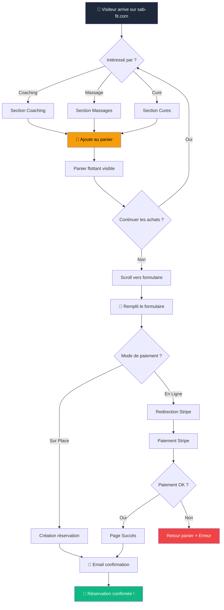

# 🎨 Design System & UX - Sab-Fit
## L'Expérience "Pop & Wellness"

---

## Identité Visuelle

### Positionnement Visuel
Sab-Fit se positionne à l'intersection de deux univers :
- **Le sport de performance** (énergie, force, détermination)
- **Le bien-être doux** (apaisement, soin, équilibre)

Le défi design : créer une harmonie entre ces deux polarités sans que l'une ne domine l'autre.

### Palette de Couleurs

```css
/* COULEURS PRIMAIRES */
--color-primary: #3B82F6;      /* Bleu Électrique - Énergie, Performance */
--color-secondary: #F472B6;    /* Corail/Rose - Chaleur, Soin */

/* COULEURS DE FOND */
--color-bg-dark: #0F172A;      /* Slate 900 - Fond principal (Dark mode) */
--color-bg-card: #1E293B;      /* Slate 800 - Cartes, sections */
--color-bg-light: #F1F5F9;     /* Slate 100 - Fond clair alternatif */

/* COULEURS D'ACCENT */
--color-accent-gold: #F59E0B;   /* Or - Promotions, Alertes */
--color-accent-red: #EF4444;    /* Rouge - Erreurs, Urgence */
--color-accent-green: #10B981;  /* Vert - Succès, Validation */

/* COULEURS DE TEXTE */
--color-text-primary: #FFFFFF;   /* Blanc - Titres */
--color-text-secondary: #94A3B8; /* Slate 400 - Textes secondaires */
--color-text-muted: #64748B;     /* Slate 500 - Légendes */
```

### Dégradés Principaux

```css
/* DÉGRADÉ HÉRO (Bleu Électrique → Corail) */
background: linear-gradient(135deg, #3B82F6 0%, #F472B6 100%);

/* DÉGRADÉ SOMBRE (Pour sections) */
background: linear-gradient(180deg, #0F172A 0%, #1E293B 100%);

/* DÉGRADÉ PROMO (Or → Rouge doux) */
background: linear-gradient(135deg, #F59E0B 0%, #EF4444 100%);
```

### Typographie

#### Police Principale
- **Famille** : Inter (Google Fonts)
- **Fallback** : system-ui, -apple-system, sans-serif
- **Usage** : Corps de texte, UI, boutons

#### Hiérarchie

| Élément | Taille | Poids | Usage |
|---------|--------|-------|-------|
| H1 (Hero) | 48-64px | 900 (Black) | Titres de section principale |
| H2 | 32-40px | 800 (ExtraBold) | Titres de section |
| H3 | 24-28px | 700 (Bold) | Sous-sections |
| H4 | 18-20px | 600 (SemiBold) | Cartes, encarts |
| Body | 16px | 400 (Regular) | Texte courant |
| Caption | 12-14px | 500 (Medium) | Légendes, labels |
| Button | 14-16px | 700 (Bold) | Boutons d'action |

#### Règles Typographiques
- **Majuscules** : Utilisées pour les labels, boutons, et titres courts
- **Tracking** : Lettres espacées (`tracking-wider`) sur les labels uppercase
- **Line-height** : 1.5 pour le body, 1.2 pour les titres

---

## Composants UI

### Boutons

```
┌─────────────────────────────────────────────────────────────┐
│  PRIMARY BUTTON                                             │
│  ┌──────────────────────────────┐                          │
│  │   RÉSERVER MAINTENANT   →   │  Fond: Dégradé Bleu→Corail │
│  └──────────────────────────────┘  Texte: Blanc, Bold       │
│                                    Radius: 12px             │
│                                    Shadow: lg               │
└─────────────────────────────────────────────────────────────┘

┌─────────────────────────────────────────────────────────────┐
│  SECONDARY BUTTON                                           │
│  ┌──────────────────────────────┐                          │
│  │   EN SAVOIR PLUS            │  Fond: Transparent        │
│  └──────────────────────────────┘  Bordure: 2px Blanc       │
│                                    Texte: Blanc             │
└─────────────────────────────────────────────────────────────┘

┌─────────────────────────────────────────────────────────────┐
│  GHOST BUTTON                                               │
│  ┌──────────────────────────────┐                          │
│  │   Ajouter au panier         │  Fond: Slate 800          │
│  └──────────────────────────────┘  Hover: Slate 700         │
│                                    Texte: Slate 200         │
└─────────────────────────────────────────────────────────────┘
```

### Cartes de Service

```
┌────────────────────────────────────────────────────────────┐
│  ┌────────────────────────────────────────────────────┐   │
│  │                                                    │   │
│  │              [IMAGE DE SERVICE]                    │   │
│  │                                                    │   │
│  └────────────────────────────────────────────────────┘   │
│                                                            │
│  COACHING SPORTIF                    ★ POPULAIRE          │
│                                                            │
│  Programme personnalisé pour atteindre vos objectifs      │
│  de fitness avec un suivi professionnel.                   │
│                                                            │
│  ━━━━━━━━━━━━━━━━━━━━━━━━━━━━━━━━━━━━━━━━━━━━━━━━━━━━━  │
│                                                            │
│  ⏱ 60 min        👤 Individuel        💪 Intensité        │
│                                                            │
│                    70 €                                   │
│  ┌──────────────────────────────────────────────────┐     │
│  │         AJOUTER AU PANIER                        │     │
│  └──────────────────────────────────────────────────┘     │
└────────────────────────────────────────────────────────────┘

Specs:
- Fond: Slate 800 (#1E293B)
- Bordure: 1px Slate 700
- Radius: 16px
- Shadow: 0 4px 6px rgba(0,0,0,0.3)
- Hover: Léger lift (-4px) + glow bleu
```

### Formulaires

```
┌────────────────────────────────────────────────────────────┐
│  INPUT FIELD                                               │
│                                                            │
│  VOTRE NOM                                                 │
│  ┌────────────────────────────────────────────────────┐   │
│  │  Sophie Martin                                     │   │
│  └────────────────────────────────────────────────────┘   │
│                                                            │
│  Specs:                                                    │
│  - Fond: Slate 50 (#F8FAFC)                               │
│  - Bordure: 2px Slate 200 (focus: Bleu Électrique)        │
│  - Padding: 20px 24px                                     │
│  - Radius: 16px                                           │
│  - Font: 18px Bold                                        │
└────────────────────────────────────────────────────────────┘
```

---

## Parcours Utilisateurs (User Flows)

### Parcours "Réservation d'un Soin"



**Points d'attention UX :**
1. **Panier flottant** toujours visible pour rassurer l'utilisateur
2. **Auto-fill** du formulaire si données déjà saisies
3. **Deux options de paiement** clairement distinguées (Sur Place = Orange, En Ligne = Bleu)
4. **Feedback immédiat** : Confettis + message de succès
5. **Responsive** : Fonctionne parfaitement sur mobile (PWA)

---

## Principes de Design

### 1. Mobile-First
Toutes les interfaces sont conçues d'abord pour mobile, puis adaptées desktop.
- Touch targets minimum : 48x48px
- Typography adaptative (clamp())
- Navigation simplifiée sur mobile

### 2. Dark Mode par Défaut
Le site utilise un thème sombre par défaut pour :
- Créer une atmosphère premium
- Réduire la fatigue visuelle
- Mettre en valeur les couleurs vives (Bleu/Corail)

### 3. Micro-interactions
Chaque action a un feedback :
- **Hover** : Léger lift (-2px) + ombre
- **Click** : Scale 0.98 + son (optionnel)
- **Succès** : Confettis + animation
- **Erreur** : Shake + couleur rouge

### 4. Consistance
- Même radius sur tous les éléments (12-16px)
- Espacement basé sur une grille 4px
- Animations toujours 200-300ms, ease-out

---

## Responsive Breakpoints

```css
/* MOBILE (par défaut) */
@media (max-width: 639px) {
  /* Navigation hamburger */
  /* Cartes en 1 colonne */
  /* Formulaire empilé */
}

/* TABLET */
@media (min-width: 640px) and (max-width: 1023px) {
  /* Navigation visible */
  /* Cartes en 2 colonnes */
  /* Formulaire 2 colonnes */
}

/* DESKTOP */
@media (min-width: 1024px) {
  /* Navigation complète */
  /* Cartes en 3 colonnes */
  /* Hero avec image de fond */
}
```

---

## PWA (Progressive Web App)

### Caractéristiques
Le site est une PWA, ce qui signifie :
- ✅ **Installable** : Les clients peuvent "ajouter à l'écran d'accueil"
- ✅ **Hors-ligne** : Fonctionne même sans connexion (mode cache)
- ✅ **Notifications** : Possibilité d'envoyer des push (futur)
- ✅ **Icône propre** : Comme une vraie application

### Installation par le Client
```
Sur iPhone :
1. Ouvrir Safari → sab-fit.com
2. Toucher "Partager" (carré avec flèche)
3. "Sur l'écran d'accueil"
4. Confirmer

Sur Android :
1. Ouvrir Chrome → sab-fit.com
2. Popup "Ajouter à l'écran d'accueil"
3. Confirmer
```

---

## Assets et Ressources

### Icônes
- **Librairie** : Lucide React
- **Style** : Outline, 1.5px stroke
- **Taille** : 20-24px (UI), 32-48px (Feature)

### Images
- **Format** : WebP avec fallback JPG
- **Optimisation** : Next.js Image component
- **Lazy loading** : Sur toutes les images sauf hero

### Animations
- **Librairie** : Framer Motion
- **Page transitions** : Fade + slide
- **Scroll animations** : Intersection Observer
- **Parallax** : Sur le hero uniquement (performance)

---

*Design System - Version 1.0*
