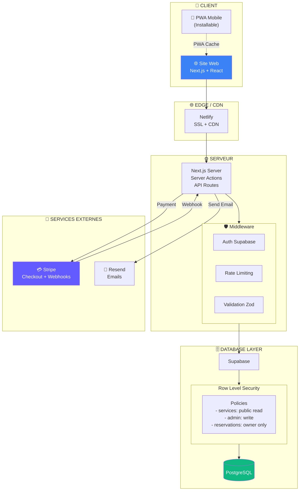
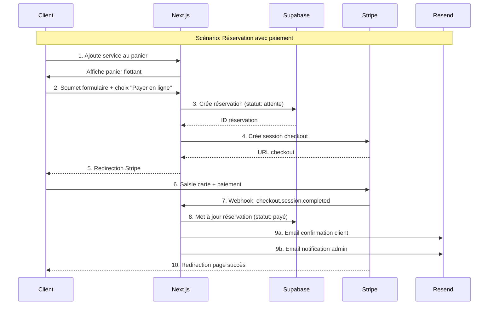
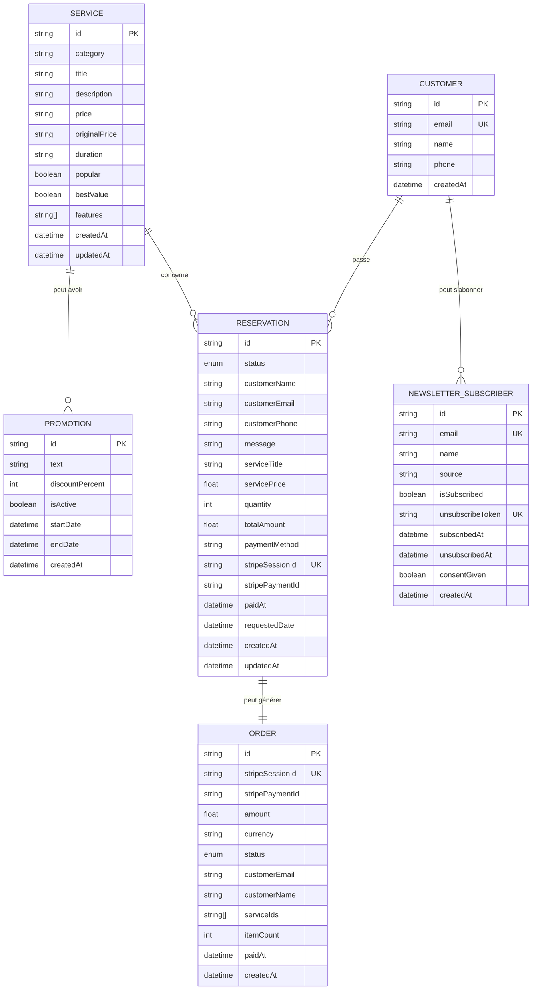
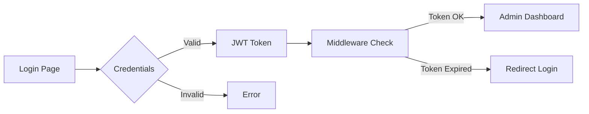
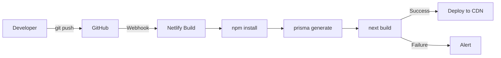

# 🏗️ Architecture Technique - Sab-Fit
## Documentation Technique Complète

---

## Stack Technique

### Vue d'Ensemble

```
┌─────────────────────────────────────────────────────────────────────────────┐
│                           SAB-FIT PLATFORM                                   │
├─────────────────────────────────────────────────────────────────────────────┤
│                                                                              │
│  ┌───────────────────────────────────────────────────────────────────────┐  │
│  │   🌐 FRONTEND WEB                                                    │  │
│  │   Next.js 16 (React 19)                                              │  │
│  │   Tailwind CSS 4                                                     │  │
│  │   PWA (Progressive Web App)                                          │  │
│  └──────────────────────────┬────────────────────────────────────────────┘  │
│                              │                                               │
│                              │ API / Server Actions                          │
│                              ▼                                               │
│  ┌───────────────────────────────────────────────────────────────────────┐  │
│  │   ⚙️ BACKEND / BaaS                                                   │  │
│  │   Supabase (PostgreSQL + Auth)                                        │  │
│  │   Prisma ORM                                                          │  │
│  └──────────────────────────┬────────────────────────────────────────────┘  │
│                              │                                               │
│           ┌──────────────────┼──────────────────┐                           │
│           │                  │                  │                           │
│           ▼                  ▼                  ▼                           │
│  ┌─────────────┐    ┌──────────────┐    ┌──────────────┐                   │
│  │   💳 STRIPE │    │   📧 RESEND  │    │   🌐 NETLIFY │                   │
│  │   Paiement  │    │   Emails     │    │   Hosting    │                   │
│  └─────────────┘    └──────────────┘    └──────────────┘                   │
│                                                                              │
└─────────────────────────────────────────────────────────────────────────────┘
```

### Technologies Détaillées

#### Frontend Web
| Technologie | Version | Rôle |
|-------------|---------|------|
| Next.js | 16.1.3 | Framework React avec App Router |
| React | 19.2.3 | UI Library |
| TypeScript | 5.x | Typage statique |
| Tailwind CSS | 4.x | Styling utility-first |
| Framer Motion | 12.x | Animations |
| Zod | 4.x | Validation schémas |

#### Backend & Database
| Technologie | Version | Rôle |
|-------------|---------|------|
| Supabase | - | BaaS (Backend as a Service) |
| PostgreSQL | 15+ | Base de données relationnelle |
| Prisma | 5.22 | ORM (Object-Relational Mapping) |
| Supabase Auth | - | Authentification |
| Row Level Security | - | Sécurité base de données |

#### Services Externes
| Service | Usage |
|---------|-------|
| Stripe | Paiements en ligne (carte, PayPal) |
| Resend | Envoi d'emails transactionnels |
| Netlify | Hébergement et CI/CD |

---

## Architecture Détaillée

### Diagramme d'Architecture



### Flux de Données



---

## Schéma de Base de Données (ERD)

### Diagramme Entité-Relation



### Modèles Détaillés

#### 1. Service (Prestations)
```typescript
interface Service {
  id: string;              // CUID unique
  category: string;        // "Coaching", "Massages", "Cures"
  title: string;           // Nom du service
  description: string;     // Description longue
  price: string;           // Format: "70 €"
  originalPrice?: string;  // Prix barré (promo)
  duration?: string;       // "60 min"
  popular: boolean;        // Badge "Populaire"
  bestValue: boolean;      // Badge "Meilleur rapport"
  features: string[];      // Liste des avantages
  createdAt: Date;
  updatedAt: Date;
}
```

#### 2. Reservation (Réservations)
```typescript
enum ReservationStatus {
  'attente_paiement_sur_place',  // Créée, paiement à venir
  'paye_confirme',                // Payée (Stripe ou confirmé)
  'annule',                       // Annulée
  'termine'                       // Service rendu
}

interface Reservation {
  id: string;
  status: ReservationStatus;
  
  // Client
  customerName: string;
  customerEmail: string;
  customerPhone: string;
  message?: string;
  
  // Service (dénormalisé pour historique)
  serviceTitle: string;
  servicePrice: number;
  quantity: number;
  totalAmount: number;
  
  // Paiement
  paymentMethod: 'sur_place' | 'stripe';
  stripeSessionId?: string;  // Lien avec Stripe
  stripePaymentId?: string;  // ID transaction
  paidAt?: Date;
  
  // Planning
  requestedDate?: Date;      // Date souhaitée
  confirmedDate?: Date;      // Date confirmée par Sabrina
  
  createdAt: Date;
  updatedAt: Date;
}
```

#### 3. Promotion (Offres spéciales)
```typescript
interface Promotion {
  id: string;
  text?: string;              // Texte de la promo
  discountPercent?: number;   // % de réduction
  services: Service[];        // Services concernés
  isActive: boolean;
  startDate?: Date;
  endDate?: Date;
  createdAt: Date;
}
```

---

## PWA (Progressive Web App)

### Configuration

Le site est configuré comme une PWA via `@ducanh2912/next-pwa` :

```javascript
// next.config.js (simplifié)
const withPWA = require('@ducanh2912/next-pwa')({
  dest: 'public',
  register: true,
  skipWaiting: true,
  disable: process.env.NODE_ENV === 'development'
});
```

### Fichiers PWA

```
public/
├── manifest.json          # Configuration PWA
├── sw.js                  # Service Worker (auto-généré)
└── icons/
    ├── icon-192x192.png   # Icône Android
    ├── icon-512x512.png   # Icône iOS/Splash
    └── apple-touch-icon.png
```

### Manifest.json

```json
{
  "name": "Sab-Fit",
  "short_name": "Sab-Fit",
  "description": "Coaching & Bien-être - Pop & Wellness",
  "start_url": "/",
  "display": "standalone",
  "background_color": "#0F172A",
  "theme_color": "#3B82F6",
  "icons": [
    { "src": "/icons/icon-192x192.png", "sizes": "192x192" },
    { "src": "/icons/icon-512x512.png", "sizes": "512x512" }
  ]
}
```

### Capacités PWA

| Fonctionnalité | Statut | Description |
|----------------|--------|-------------|
| **Installable** | ✅ | Ajout à l'écran d'accueil |
| **Hors-ligne** | ✅ | Cache des pages visitées |
| **Réactivité** | ✅ | < 3s temps de chargement |
| **Push** | ⏳ | Notifications (Phase 2) |

---

## Sécurité

### Authentification (Supabase Auth)



### Row Level Security (RLS)

```sql
-- Exemple de policies RLS

-- Services: Lecture publique, écriture admin
ALTER TABLE services ENABLE ROW LEVEL SECURITY;

CREATE POLICY "Services visibles par tous" ON services
  FOR SELECT USING (true);

CREATE POLICY "Services modifiables par admin" ON services
  FOR ALL USING (
    auth.role() = 'authenticated' AND 
    auth.jwt() ->> 'role' IN ('ADMIN', 'DEVELOPER')
  );

-- Réservations: Accessible uniquement par l'admin (via serveur)
ALTER TABLE reservations ENABLE ROW LEVEL SECURITY;

CREATE POLICY "Réservations accessibles service_role" ON reservations
  FOR ALL USING (auth.role() = 'service_role');
```

---

## Déploiement

### Pipeline CI/CD (Netlify)



### Variables d'Environnement Requises

```bash
# Database
DATABASE_URL=postgresql://...
DIRECT_URL=postgresql://...

# Supabase
NEXT_PUBLIC_SUPABASE_URL=https://...
NEXT_PUBLIC_SUPABASE_ANON_KEY=eyJ...
SUPABASE_SERVICE_ROLE_KEY=eyJ...

# Stripe
STRIPE_SECRET_KEY=sk_live_...
NEXT_PUBLIC_STRIPE_PUBLISHABLE_KEY=pk_live_...
STRIPE_WEBHOOK_SECRET=whsec_...

# Email
RESEND_API_KEY=re_...

# App
NEXT_PUBLIC_URL=https://www.sab-fit.com
```

---

*Architecture Technique - Version 1.0*
