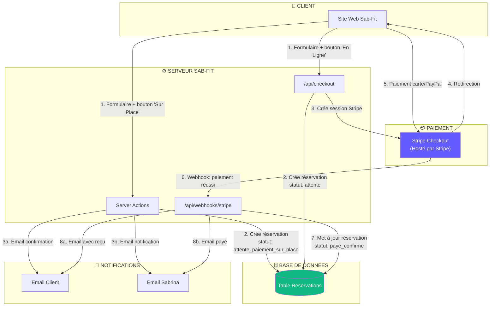
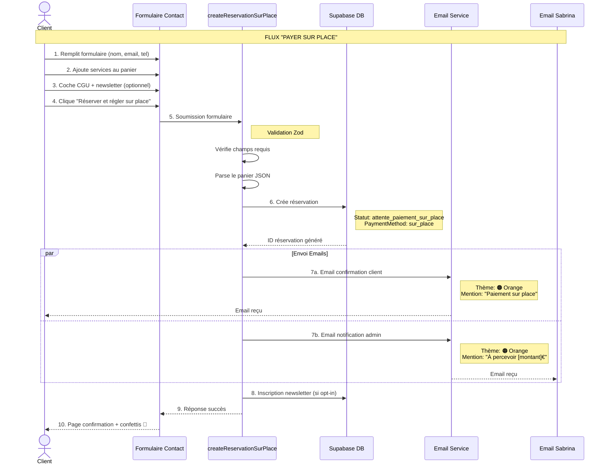
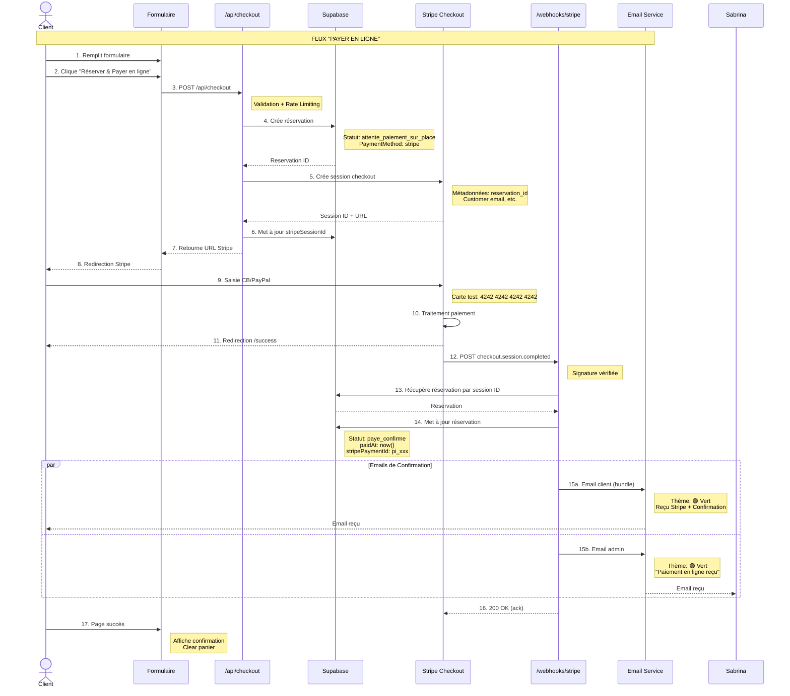

# 💳 Flux de Paiement & Sécurité
## Documentation Technique Paiement

---

## Vue d'Ensemble des Flux

### Architecture des Paiements



---

## Flux 1 : Paiement sur Place

### Diagramme de Séquence



### Détail Technique

#### 1. Server Action : `createReservationSurPlace`

```typescript
// src/app/actions.ts

export async function createReservationSurPlace(prevState: any, formData: FormData) {
  // ÉTAPE 1: Validation Zod
  const result = ContactSchema.safeParse(rawData);
  if (!result.success) {
    return { success: false, errors: result.error.flatten().fieldErrors };
  }

  // ÉTAPE 2: Parser le panier
  const parsedCart = JSON.parse(cart);
  const cartItems = parsedCart.items;
  const totalAmount = cartItems.reduce((sum, item) => 
    sum + (parseFloat(item.price) * item.quantity), 0
  );

  // ÉTAPE 3: Création réservation
  const reservation = await prisma.reservation.create({
    data: {
      status: 'attente_paiement_sur_place',  // ← Statut initial
      customerName: name,
      customerEmail: email,
      customerPhone: phone,
      message: message,
      serviceTitle: cartItems.map(i => i.title).join(', '),
      totalAmount: totalAmount,
      paymentMethod: 'sur_place',              // ← Mode sur place
      // stripeSessionId: null (pas de lien Stripe)
    }
  });

  // ÉTAPE 4: Emails
  await sendConfirmationToCustomerSurPlace({  // 🟠 Orange
    customerName: name,
    customerEmail: email,
    reservationId: reservation.id,
    services: cartItems,
    total: totalAmount,
  });

  await sendNotificationToSabrinaSurPlace({   // 🟠 Orange
    reservationId: reservation.id,
    customerName: name,
    // ... autres infos
  });

  return { success: true, reservationId: reservation.id };
}
```

#### 2. Email Client (Thème Orange)

**Sujet :** `⏳ Réservation enregistrée - Réf: ABC123`

**Contenu :**
- ✅ Confirmation des services réservés
- ⚠️ **Alerte visuelle orange** : "Paiement sur place"
- 💳 Mention : "Le règlement de XX€ se fera directement lors de votre rendez-vous"
- 📅 Date souhaitée (si précisée)
- 📞 Contact Sabrina

#### 3. Email Admin (Thème Orange)

**Sujet :** `🔔 Nouvelle réservation - Paiement sur place - [Nom] - XX€`

**Contenu :**
- 👤 Coordonnées complètes du client
- 📋 Détail des prestations
- ⚠️ **Alerte orange** : "Mode de règlement : Paiement direct lors du RDV"
- 💰 **Montant à percevoir** : XX€
- 📧 Bouton "Répondre au client"

---

## Flux 2 : Paiement en Ligne (Stripe)

### Diagramme de Séquence Complet



### Détail Technique

#### 1. API Checkout

```typescript
// src/app/api/checkout/route.ts

export async function POST(request: Request) {
  // 1. Validation
  const { items, customerName, customerEmail, customerPhone, message } = 
    checkoutSchema.parse(body);

  // 2. Récupération prix depuis DB (sécurité)
  const servicesFromDb = await prisma.service.findMany({
    where: { id: { in: items.map(i => i.id) } }
  });

  // 3. Création ligne Stripe
  const lineItems = servicesFromDb.map(service => ({
    price_data: {
      currency: 'eur',
      product_data: { name: service.title },
      unit_amount: Math.round(parseFloat(service.price) * 100),
    },
    quantity: 1,
  }));

  const totalAmount = lineItems.reduce((sum, item) => 
    sum + item.price_data.unit_amount, 0
  );

  // 4. CRÉATION RÉSERVATION (avant Stripe!)
  const reservation = await prisma.reservation.create({
    data: {
      status: 'attente_paiement_sur_place',
      customerName,
      customerEmail,
      customerPhone,
      message,
      serviceTitle: servicesFromDb.map(s => s.title).join(', '),
      totalAmount: totalAmount / 100,
      paymentMethod: 'stripe',
      // stripeSessionId: à remplir après
    }
  });

  // 5. Création session Stripe
  const session = await stripe.checkout.sessions.create({
    payment_method_types: ['card', 'paypal'],
    line_items: lineItems,
    mode: 'payment',
    success_url: `${baseUrl}/success?session_id={CHECKOUT_SESSION_ID}`,
    cancel_url: `${baseUrl}/?canceled=true`,
    customer_email: customerEmail,
    metadata: {
      reservation_id: reservation.id,  // ← LIEN CRUCIAL
      customer_name: customerName,
      // ... autres métadonnées
    }
  });

  // 6. Mise à jour avec Stripe Session ID
  await prisma.reservation.update({
    where: { id: reservation.id },
    data: { stripeSessionId: session.id }
  });

  return NextResponse.json({ url: session.url });
}
```

#### 2. Webhook Stripe

```typescript
// src/app/api/webhooks/stripe/route.ts

export async function POST(req: Request) {
  // 1. Vérification signature
  const event = stripe.webhooks.constructEvent(
    body, signature, process.env.STRIPE_WEBHOOK_SECRET
  );

  if (event.type === 'checkout.session.completed') {
    const session = event.data.object;
    
    // 2. Récupération réservation
    const reservation = await prisma.reservation.findUnique({
      where: { stripeSessionId: session.id }
    });

    if (!reservation) {
      console.error('Réservation non trouvée');
      return;
    }

    // 3. Mise à jour statut PAYÉ
    await prisma.reservation.update({
      where: { id: reservation.id },
      data: {
        status: 'paye_confirme',
        stripePaymentId: session.payment_intent as string,
        paidAt: new Date()
      }
    });

    // 4. Récupération reçu Stripe
    let receiptUrl = null;
    if (session.payment_intent) {
      const paymentIntent = await stripe.paymentIntents.retrieve(
        session.payment_intent as string
      );
      if (paymentIntent.latest_charge) {
        const charge = await stripe.charges.retrieve(
          paymentIntent.latest_charge as string
        );
        receiptUrl = charge.receipt_url;
      }
    }

    // 5. Emails de confirmation PAYÉ
    await sendConfirmationToCustomerPaye({      // 🟢 Vert
      customerName: reservation.customerName,
      customerEmail: reservation.customerEmail,
      reservationId: reservation.id,
      services: [{ title: reservation.serviceTitle, price: reservation.totalAmount }],
      total: reservation.totalAmount,
      stripeReceiptUrl: receiptUrl,  // ← Reçu Stripe
      paidAt: new Date()
    });

    await sendNotificationToSabrinaPaye({       // 🟢 Vert
      reservationId: reservation.id,
      customerName: reservation.customerName,
      stripePaymentId: reservation.stripePaymentId,
      paidAt: new Date()
      // ... autres infos
    });
  }

  return NextResponse.json({ received: true });
}
```

#### 3. Email Client Payé (Thème Vert)

**Sujet :** `✅ Réservation confirmée & payée - Réf: ABC123`

**Contenu (BUNDLE) :**
```
┌─────────────────────────────────────────┐
│  🧾 REÇU DE PAIEMENT                    │
│  Montant payé: 70.00€                   │
│  Date: 15/02/2025                       │
│  [📄 Télécharger le reçu Stripe]        │
├─────────────────────────────────────────┤
│  ✅ CONFIRMATION RÉSERVATION            │
│  Coaching Sportif x1                    │
│  Payé: 70.00€ ✓                         │
├─────────────────────────────────────────┤
│  Sabrina vous contactera sous 24h       │
└─────────────────────────────────────────┘
```

#### 4. Email Admin Payé (Thème Vert)

**Sujet :** `✅ Réservation PAYÉE - [Nom] - 70€ ✅`

**Contenu :**
- ✅ **Alerte verte** : "Paiement en ligne reçu (Stripe)"
- 💰 Montant payé
- 🔢 Numéro de transaction Stripe
- 📅 Date/heure du paiement
- 👤 Coordonnées client
- 📋 Services payés

---

## Tableau Comparatif des Flux

| Aspect | Paiement Sur Place | Paiement En Ligne |
|--------|-------------------|-------------------|
| **Moment création réservation** | Au clic | Avant Stripe |
| **Statut initial** | `attente_paiement_sur_place` | `attente_paiement_sur_place` |
| **Statut final** | Reste `attente` | `paye_confirme` |
| **Stripe utilisé ?** | ❌ Non | ✅ Oui |
| **Webhook Stripe ?** | ❌ Non | ✅ Oui |
| **Email envoyé par** | Server Action | Webhook |
| **Couleur thème email** | 🟠 Orange | 🟢 Vert |
| **Mention clé client** | "Paiement sur place" | "Payé ✅ + Reçu" |
| **Mention clé admin** | "À percevoir XX€" | "✅ Payé XX€" |
| **Action Sabrina** | Attendre le client | Rien, déjà payé |

---

## Sécurité

### Principes de Sécurité Appliqués

#### 1. Données Bancaires
```
┌─────────────────────────────────────────────┐
│  ❌ JAMAIS stockées chez nous               │
│                                             │
│  Les numéros de carte sont gérés            │
│  exclusivement par Stripe (PCI DSS)         │
│                                             │
│  Nous stockons uniquement :                 │
│  - stripeSessionId (référence)              │
│  - stripePaymentId (référence)              │
│  - Montant + Date                           │
└─────────────────────────────────────────────┘
```

#### 2. Validation des Prix
```typescript
// ❌ INTERDIT: Faire confiance au client
const price = body.price;  // Client peut envoyer 1€ au lieu de 70€

// ✅ OBLIGATOIRE: Récupérer depuis DB
const service = await prisma.service.findUnique({
  where: { id: body.serviceId }
});
const realPrice = parseFloat(service.price);
```

#### 3. Protection Webhook
```typescript
// Vérification cryptographique de la signature Stripe
const event = stripe.webhooks.constructEvent(
  payload,
  signature,
  process.env.STRIPE_WEBHOOK_SECRET  // Secret connu uniquement serveur
);
```

#### 4. Rate Limiting
```typescript
// Protection contre les abus de checkout
const rateLimitResult = rateLimit(`checkout:${clientIp}`, {
  maxRequests: 10,
  windowMs: 60 * 60 * 1000  // 1 heure
});
```

### Certifications et Conformité

| Aspect | Conformité |
|--------|------------|
| **Paiement** | Stripe est PCI DSS Level 1 |
| **Données perso** | RGPD (droits d'accès, suppression) |
| **Emails** | Double opt-in newsletter |
| **Authentification** | JWT + Row Level Security |

---

## Cartes de Test Stripe

| Numéro | Résultat | Usage |
|--------|----------|-------|
| `4242 4242 4242 4242` | ✅ Succès | Test normal |
| `4000 0025 0000 3155` | ✅ 3D Secure | Test authentification |
| `4000 0000 0000 9995` | ❌ Refus | Test erreur (fonds) |

**Informations complémentaires :**
- Date : N'importe quelle date future (12/25)
- CVC : 3 chiffres quelconques (123)
- Nom : Test User

---

*Flux de Paiement & Sécurité - Version 1.0*
