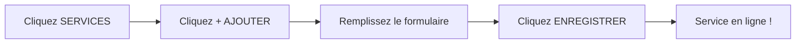
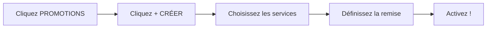
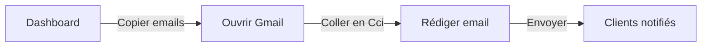

# 📖 Manuel Administrateur - Sab-Fit
## Guide d'Utilisation du Dashboard

> **Pour** : Sabrina (Propriétaire)  
> **Objectif** : Gérer les services, promotions et réservations  
> **Niveau** : Débutant à intermédiaire

---

## 🚀 Accès au Dashboard

### Connexion
1. Allez sur : `https://www.sab-fit.com/admin`
2. Saisissez votre email : `sabcompan8306@gmail.com`
3. Entrez votre mot de passe
4. Cliquez sur **"Connexion"**

```
┌──────────────────────────────────────────┐
│         🔐 CONNEXION ADMIN               │
│                                          │
│  Email: sabcompan8306@gmail.com         │
│  Password: ••••••••••••                 │
│                                          │
│  [        SE CONNECTER        ]         │
│                                          │
└──────────────────────────────────────────┘
```

> 💡 **Astuce** : Cochez "Se souvenir de moi" pour éviter de vous reconnecter à chaque fois.

---

## 📋 Navigation du Dashboard

### Menu Principal

```
┌─────────────────────────────────────────────────────────────┐
│  🏠 SAB-FIT ADMIN                                    👤    │
├─────────────────────────────────────────────────────────────┤
│                                                             │
│  📊 TABLEAU DE BORD  ← Page d'accueil avec stats           │
│                                                             │
│  🛎️ SERVICES         ← Gérer vos prestations               │
│                                                             │
│  🏷️ PROMOTIONS       ← Créer des offres flash             │
│                                                             │
│  📅 RÉSERVATIONS     ← Voir les commandes                  │
│                                                             │
│  📧 NEWSLETTER       ← Gérer les abonnés                   │
│                                                             │
├─────────────────────────────────────────────────────────────┤
│  ⚙️ PARAMÈTRES       ← Votre profil                        │
│  🚪 DÉCONNEXION                                          │
└─────────────────────────────────────────────────────────────┘
```

---

## 🛎️ Guide 1 : Gérer les Services

### Ajouter un Nouveau Service



#### Étape par Étape :

**1. Accéder à la section**
- Dans le menu, cliquez sur **"🛎️ SERVICES"**
- Vous voyez la liste de tous vos services actuels

**2. Créer un service**
- Cliquez sur le bouton **"+ Ajouter un service"** (en haut à droite)
- Un formulaire s'ouvre

**3. Remplir les informations**

```
┌─────────────────────────────────────────────────────┐
│  🆕 NOUVEAU SERVICE                                 │
├─────────────────────────────────────────────────────┤
│                                                     │
│  Titre *              [ Coaching Sportif         ] │
│  ─────────────────────────────────────────────────│
│                                                     │
│  Catégorie *          [ Coaching ▼ ]              │
│                      [ Massages   ]              │
│                      [ Cures      ]              │
│                                                     │
│  Prix *               [ 70 ] €                    │
│                                                     │
│  Durée                [ 60 ] min                  │
│                                                     │
│  Description          [ Programme personnalisé   ]│
│                       [ pour atteindre vos...    ]│
│                                                     │
│  Fonctionnalités      [• Bilan initial          ]│
│  (une par ligne)      [• Programme sur mesure   ]│
│                       [• Suivi hebdomadaire     ]│
│                                                     │
│  ☑️ Populaire         [Cocher pour badge orange] │
│                                                     │
│  ☑️ Meilleur rapport  [Cocher pour badge vert  ] │
│                                                     │
│  [ ANNULER ]  [ 💾 ENREGISTRER ]                  │
└─────────────────────────────────────────────────────┘
```

**4. Explications des champs**

| Champ | Description | Exemple |
|-------|-------------|---------|
| **Titre** | Nom visible du service | "Coaching Sportif" |
| **Catégorie** | Groupement du service | Coaching / Massages / Cures |
| **Prix** | Montant en euros | 70 |
| **Durée** | Temps en minutes | 60 |
| **Description** | Texte de présentation | "Programme personnalisé..." |
| **Fonctionnalités** | Liste des avantages (une par ligne) | "Bilan initial" |
| **Populaire** | Badge "Populaire" sur le site | ⭐ |
| **Meilleur rapport** | Badge "Best Value" sur le site | 💎 |

**5. Enregistrer**
- Cliquez sur **"💾 Enregistrer"**
- Le service apparaît immédiatement sur le site web !

---

### Modifier un Service

1. Dans la liste des services, trouvez celui à modifier
2. Cliquez sur l'**icône crayon** ✏️ à droite
3. Modifiez les champs
4. Cliquez **"Mettre à jour"**

> ⚡ Les modifications sont instantanées sur le site.

---

### Supprimer un Service

1. Trouvez le service dans la liste
2. Cliquez sur l'**icône poubelle** 🗑️
3. Confirmez la suppression

> ⚠️ **Attention** : La suppression est définitive. Si vous voulez juste le cacher temporairement, modifiez-le et changez le prix ou la description.

---

## 🏷️ Guide 2 : Créer une Promotion (Panic Sell)

Le système **"Panic Sell"** permet de créer rapidement des offres promotionnelles pour stimuler les ventes.

### Quand l'utiliser ?

- 📅 **Lundi matin** : Lancer une promo de la semaine
- ⚡ **Derniere minute** : Remplir un créneau vide demain
- 🎉 **Événement** : Saint-Valentin, Été, Rentrée...

### Créer une Promotion



#### Interface "One-Click" :

```
┌─────────────────────────────────────────────────────┐
│  🏷️ CRÉER UNE PROMOTION FLASH                      │
├─────────────────────────────────────────────────────┤
│                                                     │
│  📝 Texte promo       [ -20% sur tous les massages ]│
│                                                     │
│  💸 Réduction         [ 20 ] %                      │
│                                                     │
│  🛎️ Services          ☑️ Massage Relaxant          │
│  concernés            ☑️ Massage Sportif           │
│                       ☐ Coaching (non coché)       │
│                                                     │
│  📅 Durée                                      ▼   │
│  [ 24 heures ▼ ]                                   │
│  [ 48 heures   ]                                   │
│  [ 7 jours     ]                                   │
│  [ Dates perso ]                                   │
│                                                     │
│  ━━━━━━━━━━━━━━━━━━━━━━━━━━━━━━━━━━━━━━━━━━━━━━━  │
│                                                     │
│  🔴 BANDEAU DE PREVIEW                             │
│  ⚡ -20% sur tous les massages - Plus que 24h !    │
│                                                     │
│  [ ANNULER ]  [ 🚀 ACTIVER LA PROMO ]              │
└─────────────────────────────────────────────────────┘
```

#### Boutons Rapides

| Bouton | Effet | Usage |
|--------|-------|-------|
| **24h** | Promo jusqu'à demain même heure | Urgent (créneau vide) |
| **48h** | Weekend promo | Vendredi soir |
| **7 jours** | Promo semaine | Lundi matin |
| **Dates perso** | Choix libre | Vacances, événements |

#### Résultat sur le Site

```
┌─────────────────────────────────────────────────────────────┐
│  🔴 BANDEAU ROUGE DÉFILANT                                 │
│  ⚡ -20% sur tous les massages — Plus que 23h ! →          │
├─────────────────────────────────────────────────────────────┤
│                                                             │
│  🛎️ Massage Relaxant                                       │
│  ~~70 €~~  ➜  **56 €**  (-20%)                            │
│  [ AJOUTER AU PANIER ]                                     │
│                                                             │
└─────────────────────────────────────────────────────────────┘
```

---

## 📅 Guide 3 : Suivre les Réservations

### Accéder aux Réservations

Menu → **"📅 RÉSERVATIONS"**

### Tableau de Bord des Réservations

```
┌─────────────────────────────────────────────────────────────────────────────┐
│  📅 RÉSERVATIONS                                        [🔍 Rechercher]    │
├─────────────────────────────────────────────────────────────────────────────┤
│  Filtres: [ Tous ▼ ] [ Date: Ce mois ▼ ] [ Statut: Tous ▼ ]               │
├─────────────────────────────────────────────────────────────────────────────┤
│                                                                             │
│  ┌─────────────────────────────────────────────────────────────────────┐   │
│  │ 👤 Marie Dupont              📧 marie@email.com                   │   │
│  │ 📱 06 12 34 56 78                                                 │   │
│  ├─────────────────────────────────────────────────────────────────────┤   │
│  │ 🛎️ Coaching Sportif x1                                          │   │
│  │ 💰 Total: 70 €                                                    │   │
│  ├─────────────────────────────────────────────────────────────────────┤   │
│  │ 🟢 PAYÉ EN LIGNE (Stripe)        📅 15/02/2025 à 14:30            │   │
│  │ Transaction: pi_3O...                                             │   │
│  └─────────────────────────────────────────────────────────────────────┘   │
│                                                                             │
│  ┌─────────────────────────────────────────────────────────────────────┐   │
│  │ 👤 Pierre Martin               📧 pierre@email.com                │   │
│  │ 📱 06 98 76 54 32                                                 │   │
│  ├─────────────────────────────────────────────────────────────────────┤   │
│  │ 🛎️ Massage Relaxant x2                                          │   │
│  │ 💰 Total: 140 €                                                   │   │
│  ├─────────────────────────────────────────────────────────────────────┤   │
│  │ 🟠 PAIEMENT SUR PLACE             📅 16/02/2025                   │   │
│  │ 💳 À percevoir: 140 €                                             │   │
│  └─────────────────────────────────────────────────────────────────────┘   │
│                                                                             │
│  ┌─────────────────────────────────────────────────────────────────────┐   │
│  │ 👤 Sophie Bernard              📧 sophie@email.com                │   │
│  │ 📱 06 11 22 33 44                                                 │   │
│  ├─────────────────────────────────────────────────────────────────────┤   │
│  │ 🛎️ Cure Détox x1                                                │   │
│  │ 💰 Total: 350 €                                                   │   │
│  ├─────────────────────────────────────────────────────────────────────┤   │
│  │ 🔴 ANNULÉ                         📅 10/02/2025                   │   │
│  └─────────────────────────────────────────────────────────────────────┘   │
│                                                                             │
└─────────────────────────────────────────────────────────────────────────────┘
```

### Comprendre les Statuts

| Statut | Couleur | Signification | Action requise |
|--------|---------|---------------|----------------|
| **🟢 Payé en ligne** | Vert | Client a payé par Stripe | ✅ RDV confirmé |
| **🟠 Paiement sur place** | Orange | Client paiera au RDV | 💰 Prévoir encaissement |
| **🔴 Annulé** | Rouge | Commande annulée | ❌ Ne pas honorer |
| **⚪ En attente** | Gris | Paiement Stripe en cours | ⏳ Attendre webhook |

### Actions sur une Réservation

```
┌──────────────────────────────────────────┐
│  ACTIONS DISPONIBLES                     │
├──────────────────────────────────────────┤
│                                          │
│  📧 [ Contacter le client ]              │
│     Ouvre votre client email             │
│                                          │
│  📋 [ Voir les détails ]                 │
│     Message complet du client            │
│                                          │
│  ✓ [ Marquer comme honoré ]              │
│     Quand le service est rendu           │
│                                          │
│  ✗ [ Annuler la réservation ]            │
│     En cas d'impossibilité               │
│                                          │
└──────────────────────────────────────────┘
```

---

## 📧 Guide 4 : Gérer la Newsletter

### Accéder à la Newsletter

Menu → **"📧 NEWSLETTER"**

### Statistiques en Temps Réel

```
┌─────────────────────────────────────────────────────┐
│  📧 STATISTIQUES NEWSLETTER                         │
├─────────────────────────────────────────────────────┤
│                                                     │
│  ┌──────────┐  ┌──────────┐  ┌──────────┐         │
│  │   156    │  │   142    │  │    14    │         │
│  │  Total   │  │  Actifs  │  │Désinscrits│         │
│  └──────────┘  └──────────┘  └──────────┘         │
│                                                     │
│  📈 Cette semaine: +12 nouveaux abonnés            │
│                                                     │
└─────────────────────────────────────────────────────┘
```

### Exporter les Emails

#### Méthode 1 : Copier (Rapide)
```
┌──────────────────────────────────────────┐
│  [ 📋 COPIER LES EMAILS ACTIFS ]        │
└──────────────────────────────────────────┘

Résultat dans le presse-papiers:
marie@email.com, pierre@email.com, sophie@email.com, ...
```

**Usage** : Coller directement dans Gmail/Outlook en Cci

#### Méthode 2 : Export CSV (Professionnel)
```
┌──────────────────────────────────────────┐
│  [ 📥 EXPORTER EN CSV ]                 │
└──────────────────────────────────────────┘

Fichier généré: newsletter_2025-02-15.csv

Contenu:
email,nom,date_inscription
marie@email.com,Marie Dupont,2025-02-10
pierre@email.com,Pierre Martin,2025-02-12
...
```

**Usage** : Importer dans Brevo, Mailchimp, Sendinblue...

### Envoyer une Newsletter (Méthode Manuelle)



#### Template d'Email Suggéré :

```
Objet : 🎁 -20% sur les massages ce weekend !

Bonjour [prénom si personnalisé],

J'espère que vous allez bien !

🎉 BONNE NOUVELLE
Ce weekend uniquement, profitez de -20% sur tous les massages.

Offre valable :
✓ Samedi 10h - 19h
✓ Dimanche 11h - 17h

[ RÉSERVER MA PLACE → ] https://www.sab-fit.com

À très vite,
Sabrina 💪✨

---
Se désinscrire: [lien de désinscription]
```

---

## 🆘 Guide de Dépannage

### Problème : Je ne reçois pas les emails de réservation

**Vérifications :**
1. Vérifiez vos **spam/indésirables**
2. Attendez 2-3 minutes (délai de livraison)
3. Vérifiez que l'email est bien : `sabcompan8306@gmail.com`
4. Contactez le développeur si le problème persiste

### Problème : Une réservation n'apparaît pas

**Solutions :**
1. Rafraîchissez la page (F5)
2. Vérifiez les filtres (tous les statuts sont visibles ?)
3. Demandez au client s'il a bien reçu sa confirmation

### Problème : Je ne peux plus me connecter

**Solutions :**
1. Vérifiez que vous utilisez le bon email
2. Réinitialisez votre mot de passe (lien sur la page login)
3. Contactez le développeur si bloquée

### Problème : Le site ne s'affiche pas correctement

**Solutions :**
1. Videz le cache de votre navigateur (Ctrl+Shift+R)
2. Essayez un autre navigateur (Chrome, Firefox, Safari)
3. Vérifiez votre connexion internet

---

## 📞 Support et Contact

### Besoin d'aide ?

| Problème | Contact | Réponse |
|----------|---------|---------|
| Urgent (site down) | 📱 WhatsApp | < 1h |
| Bug technique | 📧 johan.dev.pro@gmail.com | 24h |
| Nouvelle fonctionnalité | 📧 johan.dev.pro@gmail.com | 48h |
| Question sur l'admin | 📱 WhatsApp | < 4h |

---

## ✅ Checklist Quotidienne Recommandée

### Chaque Matin (5 min)
- [ ] Vérifier les nouvelles réservations
- [ ] Noter les paiements "sur place" à percevoir
- [ ] Répondre aux messages des clients

### Chaque Semaine (15 min)
- [ ] Lancer une promotion (si créneaux vides)
- [ ] Vérifier les stats newsletter
- [ ] Relancer les clients inactifs

### Chaque Mois (30 min)
- [ ] Analyser les ventes du mois
- [ ] Mettre à jour les services (prix, descriptions)
- [ ] Exporter la newsletter pour envoi

---

*Manuel Administrateur - Version 1.0*  
*Dernière mise à jour : Février 2025*
