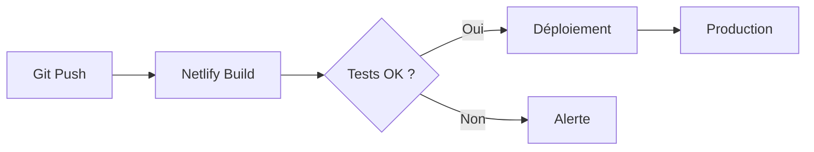

# 📦 Pack de Livraison Final - Sab-Fit

> **Projet** : Sab-Fit - Plateforme Web "Pop & Wellness"  
> **Client** : Sabrina (Coaching Sportif & Massage)  
> **Date de livraison** : Février 2025  
> **Statut** : ✅ PRODUCTION READY

---

## 🎯 Vue d'Ensemble

Ce pack contient **l'intégralité de la documentation** livrée avec la plateforme Sab-Fit :
- Un site web PWA (Progressive Web App) avec paiement Stripe
- Un dashboard admin complet
- Une stratégie digitale "Pop & Wellness"

### 🔗 URL de Production
**Site public** : https://www.sab-fit.com  
**Dashboard admin** : https://www.sab-fit.com/admin

---

## 📁 Structure du Pack

```
docs/delivery_package/
│
├── 📊 00_CONTENU_SLIDES.md          → Présentation client (10 slides)
├── 📋 01_STRATEGIE_PRODUIT.md       → Vision, personas, user stories
├── 🎨 02_DESIGN_SYSTEM.md           → Charte graphique & UX
├── 🏗️ 03_ARCHITECTURE_TECH.md       → Stack technique & modèles de données
├── 💳 04_FLUX_PAIEMENT.md           → Stripe, webhooks, sécurité
├── 📖 05_MANUEL_ADMIN.md            → Guide d'utilisation pour Sabrina
└── 📄 README.md                     → Ce fichier
```

---

## ✨ Ce qui est Livré

### 1️⃣ Site Web PWA (Next.js 16)

**Fonctionnalités :**
- ✅ Vitrine dynamique avec 3 catégories (Coaching, Massages, Cures)
- ✅ Panier flottant avec ajout/suppression de services
- ✅ **Double flux de paiement** :
  - 🟠 Sur Place : Paiement au rendez-vous
  - 🟢 En Ligne : Stripe (CB + PayPal)
- ✅ **PWA** : Installable sur mobile, fonctionne hors-ligne
- ✅ Emails automatiques avec 4 templates (2 thèmes : orange/vert)
- ✅ Page CGU RGPD-compliant

### 2️⃣ Dashboard Admin

**Gestion complète :**
- ✅ CRUD Services (avec upload d'images)
- ✅ Système de promotions "Panic Sell" (bandeau défilant)
- ✅ Suivi des réservations (statuts colorés)
- ✅ Newsletter (export CSV, statistiques)
- ✅ Authentification sécurisée (Supabase Auth)

### 3️⃣ Backend & Sécurité

**Infrastructure :**
- ✅ Supabase (PostgreSQL + Auth)
- ✅ Prisma ORM avec migrations
- ✅ Row Level Security (RLS)
- ✅ Validation Zod sur tous les formulaires
- ✅ Rate limiting (anti-spam)
- ✅ Stripe webhooks sécurisés

---

## 🎨 Identité Visuelle

### Positionnement "Pop & Wellness"
L'alliance du **sport de performance** et du **bien-être doux**.

### Palette de Couleurs
```css
--color-primary:   #3B82F6   /* Bleu Électrique - Performance */
--color-secondary: #F472B6   /* Corail - Soin & Bien-être */
--color-bg:        #0F172A   /* Slate 900 - Fond sombre */
--color-accent:    #F59E0B   /* Or - Promotions */
```

### Typographie
- **Police** : Inter (Google Fonts)
- **Style** : Bold et impactante (aspect "guerrière")
- **H1** : 48-64px / 900 Black

---

## 📊 Livrables Techniques

| Élément | Quantité | Détail |
|---------|----------|--------|
| Pages web | 6 | Home, CGU, Success, Login, Admin, 404 |
| Composants React | 25+ | Réutilisables, typés |
| Tables DB | 6 | Services, Promotions, Réservations, Orders, Newsletter, Users |
| Emails templates | 4 | 2x orange (sur place) + 2x vert (payé) |
| API Routes | 4 | Checkout, Webhooks, Services, Admin |
| Server Actions | 3 | Auth, Réservations, Newsletter |

---

## 🚀 Utilisation Immédiate

### Pour la Présentation Client

**Option 1 - Gamma.app (Recommandé)**
1. Allez sur https://gamma.app
2. Créez une nouvelle présentation
3. Copiez le contenu de `00_CONTENU_SLIDES.md`
4. Gamma génère automatiquement le design

**Option 2 - Canva**
1. Allez sur https://canva.com
2. Créez une présentation "Business"
3. Copiez chaque slide manuellement depuis le fichier

### Pour Sabrina (Manuel)

**Format digital :**
- Ouvrir `05_MANUEL_ADMIN.md` dans un lecteur Markdown
- Ou convertir en PDF via https://md2pdf.netlify.app

**Format imprimé :**
- Imprimer le fichier 05_MANUEL_ADMIN.md
- Reliure A4 recommandée

### Pour les Développeurs

**Architecture :**
- Lire `03_ARCHITECTURE_TECH.md` pour comprendre le stack
- `04_FLUX_PAIEMENT.md` pour le système Stripe

---

## 🔄 Workflow de Développement



**Commandes utiles :**
```bash
# Développement local
npm run dev

# Build production
npm run build

# Migrations DB
npx prisma db push
```

---

## 📈 Prochaines Évolutions (Roadmap)

### Phase 2 (3 mois)
- 📅 Calendrier de disponibilités interactif
- 👤 Espace client avec historique
- 🔔 Rappels automatiques par email

### Phase 3 (6 mois)
- 🎁 Programme de fidélité (points)
- ⭐ Système d'avis et témoignages
- 📊 Analytics avancées

---

## 🛠️ Support & Maintenance

### Garantie incluse
- **30 jours** de support post-livraison
- Corrections de bugs prioritaires
- Réponse sous 24h (jours ouvrés)

### Contact
- **Email** : johan.dev.pro@gmail.com
- **Urgent** : WhatsApp

### Accès Admin
- **URL** : https://www.sab-fit.com/login
- **Email** : sabcompan8306@gmail.com
- **Rôle** : ADMIN (accès complet)

---

## ✅ Checklist de Validation

Avant de remettre à Sabrina, vérifier :

- [ ] Site accessible sur https://www.sab-fit.com
- [ ] Dashboard accessible et fonctionnel
- [ ] Test de réservation "Sur Place" OK
- [ ] Test de paiement Stripe OK (carte 4242...)
- [ ] Emails reçus (confirmation + notification)
- [ ] Documentation lue et comprise

---

## 🎉 Résumé

**Sab-Fit** est maintenant une plateforme complète qui permet à Sabrina de :

1. **Présenter** ses services de manière professionnelle
2. **Vendre** en ligne 24/7 (avec ou sans paiement immédiat)
3. **Gérer** son business depuis un dashboard intuitif
4. **Communiquer** avec sa clientèle via la newsletter
5. **Sécuriser** toutes les transactions et données

**Le tout avec une identité visuelle forte et mémorable.**

---

*Pack de Livraison - Version 1.0*  
*Généré le : 10 Février 2025*  
*Déployé sur : https://www.sab-fit.com*
